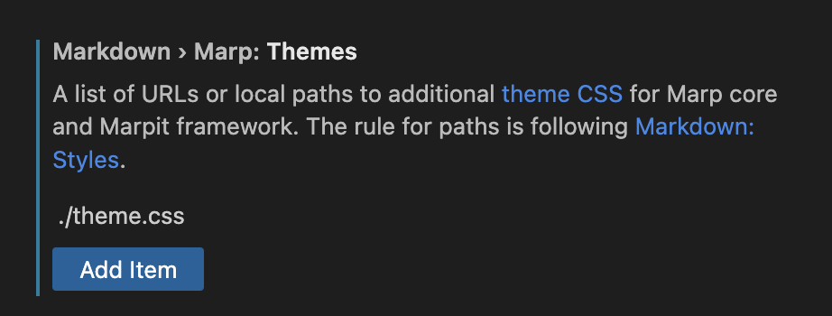

# Acknowledge MARP templates

MARP est un super outil pour générer des PDF, powerpoint et pages HTML à partir d'un markdown : [Marp](https://marpit.marp.app/)

Il peut être utile pour gagner du temps (pour ceux qui ont l'habitude de faire du markdown).

## Démarrer avec Marp

Pour démarrer simplement je vous recommande de passer par VS Code et son extension Marp : 

## Utiliser ce projet

Pour utiliser ce projet, il faut suffira de récupérer le contenu du git, et de configurer l'extension Marp de manière à lui d'aller chercher ses thèmes notamment dans le fichier `theme.css` :

Ce dernier fichier contient toute la mise en page du thème Acknowledge.

Faîtes vous plaisir.